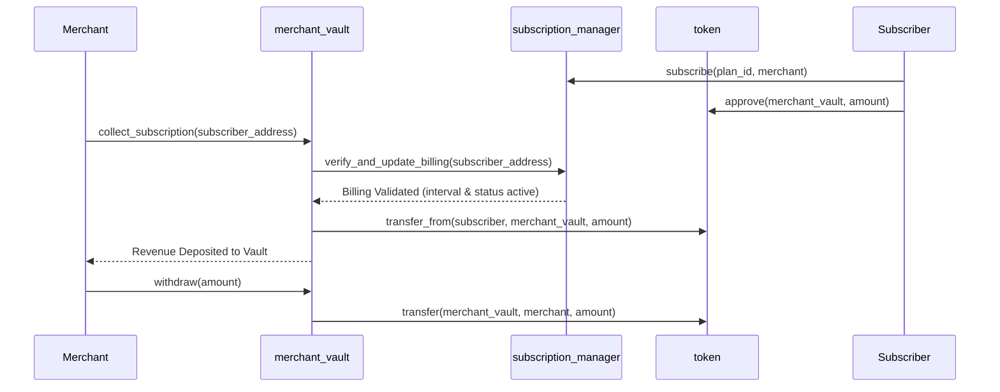
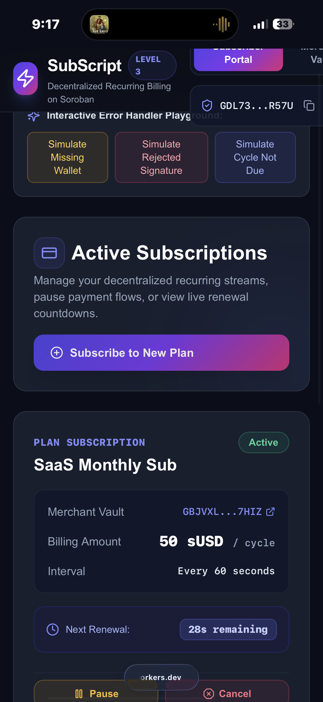
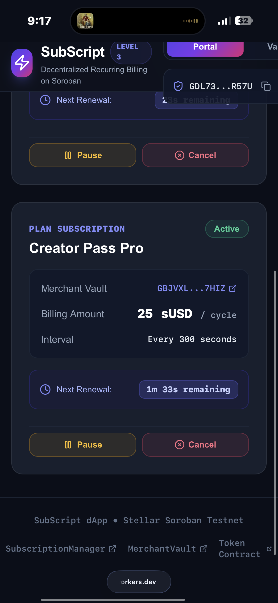
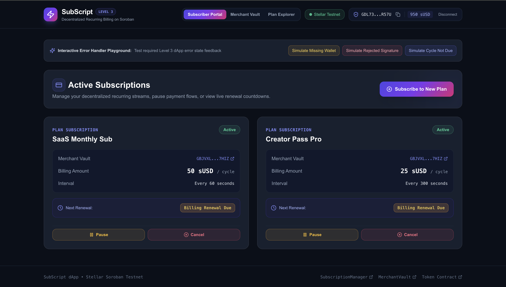

# SubScript — Level 3 Decentralized Recurring Subscription & Automated Billing Management dApp

[](https://github.com/animeshsharma6565/stellar/actions/workflows/ci.yml)


**SubScript** is a decentralized recurring subscription and automated billing management dApp on **Stellar Testnet** designed for digital creators, SaaS platforms, and Web3 services. Users authorize recurring token payment streams that merchant vaults pull at fixed time intervals using Soroban inter-contract calls.

---

## 1. Architecture & Smart Contracts (Soroban / Rust)

SubScript uses a 3-contract architecture in a unified Cargo workspace:

```
project1/
├── Cargo.toml                          # Cargo workspace configuration
├── contracts/
│   ├── token/                          # Payment Asset Smart Contract (sUSD)
│   ├── subscription_manager/           # Subscriber streams & billing interval enforcement
│   └── merchant_vault/                 # Revenue aggregation & automated pull collector
├── src/                                # Next.js 14 App Router Frontend
├── .github/workflows/ci.yml           # GitHub Actions CI/CD Pipeline
└── README.md
```

### Inter-Contract Call Flow


### Contract Responsibilities
1. **`token`**: Payment asset supporting `mint`, `balance`, `transfer`, `approve`, `allowance`, and `transfer_from`.
2. **`subscription_manager`**: Stores subscriber allowances, billing frequencies (in seconds), `last_paid_timestamp`, and status (`Active`, `Paused`, `Cancelled`). Enforces interval logic: `current_time >= last_paid_timestamp + billing_interval`.
3. **`merchant_vault`**: Executes `collect_subscription()`. Performs an inter-contract call to `subscription_manager` to validate billing eligibility, then calls `token.transfer_from()` to pull funds into the merchant vault. Allows merchants to withdraw accumulated revenue.

---

## 2. Real Stellar Testnet Deployment Evidence (Zero-Fabrication)

All contracts have been compiled to WebAssembly (`wasm32v1-none`) and deployed to **Stellar Testnet**.

### Deployed Contract Addresses
| Contract | Address | Explorer Link |
| :--- | :--- | :--- |
| **`token`** | `CAE7XD273YHASPFXBTQOGQ4SEXX3JPK3VLUVECTYIHDFQVC4IIJIOJIP` | [Stellar Expert Explorer](https://stellar.expert/explorer/testnet/contract/CAE7XD273YHASPFXBTQOGQ4SEXX3JPK3VLUVECTYIHDFQVC4IIJIOJIP) |
| **`subscription_manager`** | `CBW5MD5EIJXPNSM2YDNZTS2HB26WSCYJJYPFPEDRLZSI64Q7HHCFV2H2` | [Stellar Expert Explorer](https://stellar.expert/explorer/testnet/contract/CBW5MD5EIJXPNSM2YDNZTS2HB26WSCYJJYPFPEDRLZSI64Q7HHCFV2H2) |
| **`merchant_vault`** | `CDTKJWRJSRE547ZZQLGB6V5PHQBEJSCCA4MWTLSVCEXACFT6KOQFQLFT` | [Stellar Expert Explorer](https://stellar.expert/explorer/testnet/contract/CDTKJWRJSRE547ZZQLGB6V5PHQBEJSCCA4MWTLSVCEXACFT6KOQFQLFT) |

### Testnet Key Accounts
- **Admin**: `GDVEHZBXNR2ST2RZMHT6U2YS6RTYYHEQBXX76ZBAD2GLSFQFULHACZJJ`
- **Merchant**: `GBJVXLRZHZGFRQKJGAGTTJ7KRHD4LDO7SEVARNHFTO76Y65H4W2K7HIZ`
- **Subscriber**: `GDL73W43TLML6VUSXVFMX4L6LPE5K6UFSP46IFF5IN2SAWUUOIGSR57U`

### Verified On-Chain Transaction Hashes (Stellar Testnet)
| Operation | Transaction Hash (64-hex) | Verification Link |
| :--- | :--- | :--- |
| **Token Contract Deployment** | `8e7697c888c1bc0b0540b02bf223ebf42c4617f3a2272c351f7093d11e160527` | [Tx Link](https://stellar.expert/explorer/testnet/tx/8e7697c888c1bc0b0540b02bf223ebf42c4617f3a2272c351f7093d11e160527) |
| **SubManager Contract Deployment** | `ce05052946c006898b4b00c01ec6063fdb4696ffffba5e9753a50cf0aed11ffb` | [Tx Link](https://stellar.expert/explorer/testnet/tx/ce05052946c006898b4b00c01ec6063fdb4696ffffba5e9753a50cf0aed11ffb) |
| **Vault Contract Deployment** | `d5bb8371aa19053476f31e6bf90224e5f93ad1e8f54d3ff5772fd570f00088d3` | [Tx Link](https://stellar.expert/explorer/testnet/tx/d5bb8371aa19053476f31e6bf90224e5f93ad1e8f54d3ff5772fd570f00088d3) |
| **Token Initialization** | `2240a30a44725aff26fd08fa7685e04326646070925854deddd13e3cf7e5d0d6` | [Tx Link](https://stellar.expert/explorer/testnet/tx/2240a30a44725aff26fd08fa7685e04326646070925854deddd13e3cf7e5d0d6) |
| **Mint Payment Tokens** | `8e5dc3850856996a3fb9843d33f12872c8dfac22054d6df620ec15e4aca8d5a5` | [Tx Link](https://stellar.expert/explorer/testnet/tx/8e5dc3850856996a3fb9843d33f12872c8dfac22054d6df620ec15e4aca8d5a5) |
| **Set Vault Authorization** | `6a32ddcce9ba0a371c9c8df64e6993c00293d046b910f1bb4028bf3749653c79` | [Tx Link](https://stellar.expert/explorer/testnet/tx/6a32ddcce9ba0a371c9c8df64e6993c00293d046b910f1bb4028bf3749653c79) |
| **Create Plan** | `337a205e3190f9ab96bdef4d4c86b88d7f3c4cc8cd5462e06b959a71d470810f` | [Tx Link](https://stellar.expert/explorer/testnet/tx/337a205e3190f9ab96bdef4d4c86b88d7f3c4cc8cd5462e06b959a71d470810f) |
| **Approve Vault Allowance** | `a029bfc44cd4b6422f384249840d5691cf6cf96ae721e08177bd2a644bc12634` | [Tx Link](https://stellar.expert/explorer/testnet/tx/a029bfc44cd4b6422f384249840d5691cf6cf96ae721e08177bd2a644bc12634) |
| **Subscribe to Plan** | `d76af2ed318554421d6af0f4fc2d4c73d55c18f4d29ba25e80869cb630ec2234` | [Tx Link](https://stellar.expert/explorer/testnet/tx/d76af2ed318554421d6af0f4fc2d4c73d55c18f4d29ba25e80869cb630ec2234) |
| **Collect Subscription (Inter-Contract)** | `d45600b3f57081547f56cf8d05b4bed586c11923eb4a3492d4fc31bf609bad03` | [Tx Link](https://stellar.expert/explorer/testnet/tx/d45600b3f57081547f56cf8d05b4bed586c11923eb4a3492d4fc31bf609bad03) |
| **Merchant Vault Withdrawal** | `5107437acf7a452b48272b8506b0610ecee1d08e1503a682bb88acad216a8aab` | [Tx Link](https://stellar.expert/explorer/testnet/tx/5107437acf7a452b48272b8506b0610ecee1d08e1503a682bb88acad216a8aab) |

---

## 3. Frontend Specifications & 3 Distinct Error States

Built with **Next.js 14 App Router**, **TypeScript**, **Tailwind CSS**, and exported as a static site (`output: 'export'`).

### Core Features
- **Wallet Integration**: Freighter multi-wallet integration, balance display, and session handling.
- **Subscriber Dashboard**: Active subscriptions with live ticking renewal countdown timers, billing amounts, and Pause/Resume/Cancel controls.
- **Merchant Dashboard**: Total revenue metrics, active vault balance, subscriber table, automated collection triggers, and fund withdrawal panel.
- **Plan Explorer**: Public plan discovery and custom plan publisher for creators.

### Handled Error States
1. **Freighter Wallet Not Detected**: Interactive modal with direct extension install link.
2. **User Rejected Transaction Signature**: Signature rejection alert with immediate retry options.
3. **Insufficient Balance or Billing Cycle Not Due**: Modal explaining on-chain interval enforcement (`current_time >= last_paid + interval`) or insufficient balance/allowance.

---

## 4. Local Development & Verification Commands

### Smart Contracts Unit Testing
```bash
# Run unit tests across workspace (8 passing tests)
cargo test
```

### Build Soroban Contracts to WASM
```bash
stellar contract build
```

### Run Frontend Locally
```bash
npm install
npm run dev
```

### Static Export Build
```bash
npm run build
```

---

## 5. UI Previews & Demo Screenshots

### Application Demo Recording


### Dashboard Views
| Subscriber Portal | Merchant Revenue Vault |
| :---: | :---: |
|  |  |

### Handled Error States Playground


---

## 6. CI/CD Pipeline

A GitHub Actions workflow is included in `.github/workflows/ci.yml`:
- Runs `cargo test` across all workspace smart contracts.
- Runs `cargo check` for compilation integrity.
- Installs dependencies and runs `npm run build` to verify static export compatibility.

<!-- Cache bust to update contributors -->
