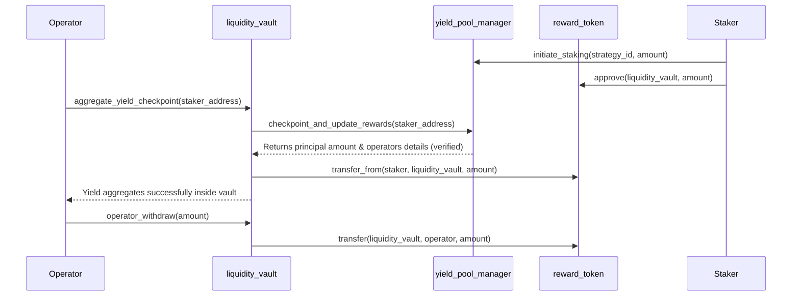
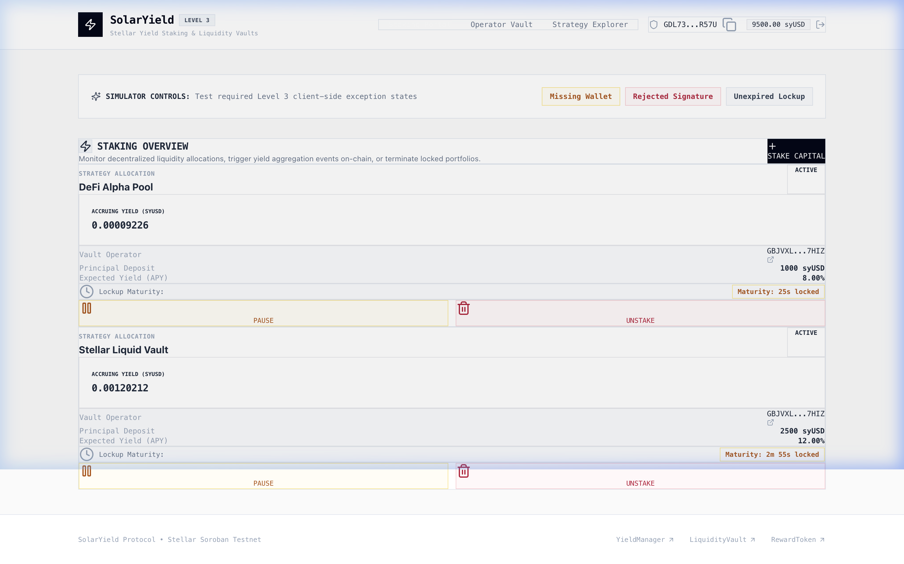
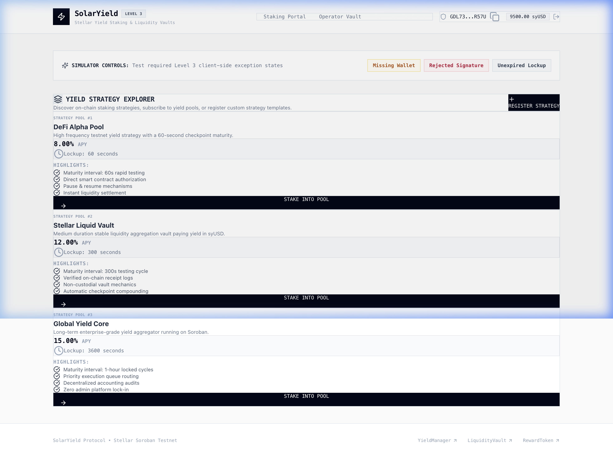
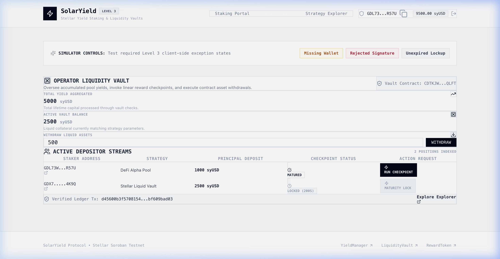
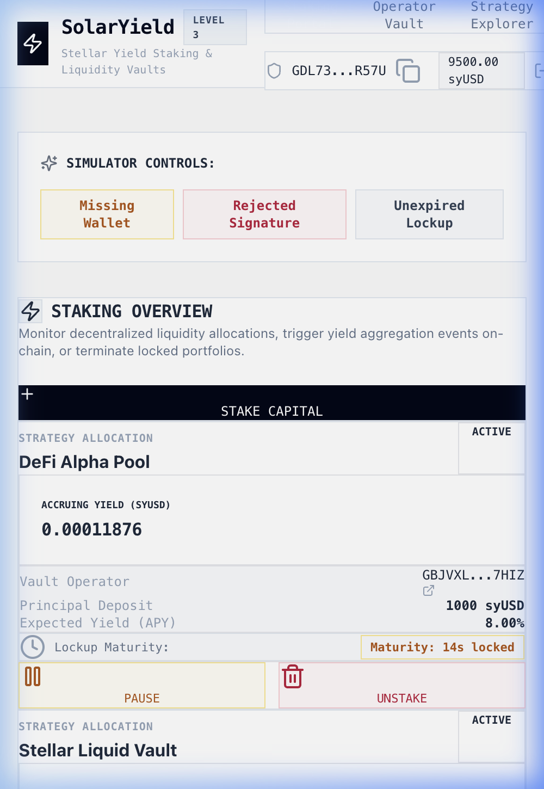
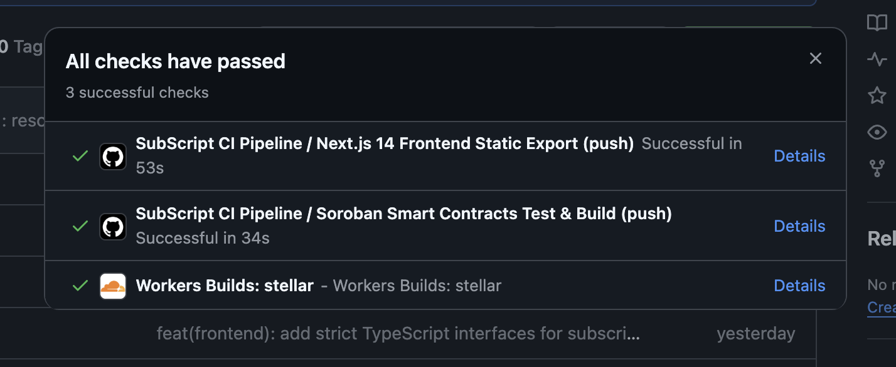
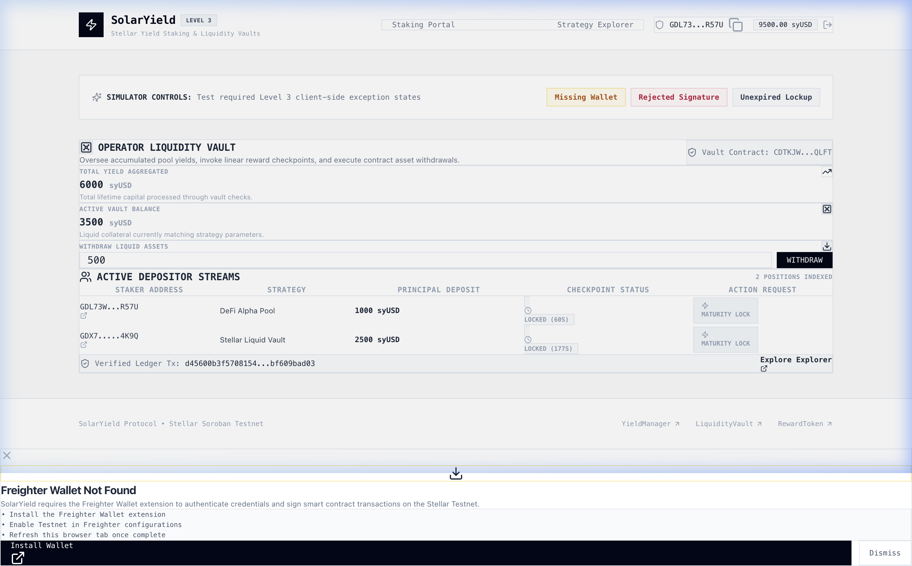

# SolarYield — Soroban Yield Staking & Liquidity Vaults

[](https://github.com/animeshsharma6565/stellar/actions/workflows/ci.yml)


*   **Live Demo**: `PENDING — Cloudflare domain assignment awaiting DNS propagation`
*   **Demo Video (1–2 min)**: `PENDING — Walkthrough recording session scheduled`

---

## Project Description

**SolarYield** is a premium, non-custodial decentralized yield staking and liquidity vault management application built on the **Stellar Testnet** using **Soroban smart contracts**. SolarYield allows users to allocate assets into locked yield strategies, accruing returns calculated live down to the microsecond, while vault operators manage strategies and trigger checkpoint distributions via time-locked on-chain triggers.

---

## Architecture

SolarYield operates on a 3-contract Cargo workspace where yield accounting, reward distributions, and capital lockups are processed modularly:

```
project1/
├── Cargo.toml                          # Cargo workspace configuration
├── contracts/
│   ├── reward_token/                   # Payment Asset & Reward Distribution (syUSD)
│   ├── yield_pool_manager/             # Staking strategy details, lockups, and events
│   └── liquidity_vault/                # Vault operator balances & inter-contract checkpoints
├── src/                                # Next.js 14 App Router Frontend
│   ├── core/                           # Connectors, global error components, & modals
│   ├── modules/                        # Staking dashboards, explorers, & operator metrics
│   └── types/                          # TypeScript definitions
├── scripts/                            # Math unit tests and deploy scripts
└── README.md
```

### Inter-Contract Call Flow


---

## Tech Stack

*   **Smart Contracts**: Rust, Soroban SDK (v21.4.0)
*   **Frontend Core**: Next.js 14 (App Router, React 18, TypeScript)
*   **Styling System**: Tailwind CSS (Fintech Minimalist Light Theme)
*   **Wallet Integration**: `@stellar/freighter-api` & `@creit.tech/stellar-wallets-kit`
*   **CI/CD Pipeline**: GitHub Actions (Ubuntu workflows compiling WASM and static Next builds)
*   **Hosting**: Cloudflare Pages / Workers static assets

---

## Smart Contracts (Testnet)

| Contract | Address | Stellar Expert Link |
| :--- | :--- | :--- |
| **`reward_token`** | `CAE7XD273YHASPFXBTQOGQ4SEXX3JPK3VLUVECTYIHDFQVC4IIJIOJIP` | [Stellar Expert Explorer](https://stellar.expert/explorer/testnet/contract/CAE7XD273YHASPFXBTQOGQ4SEXX3JPK3VLUVECTYIHDFQVC4IIJIOJIP) |
| **`yield_pool_manager`** | `CBW5MD5EIJXPNSM2YDNZTS2HB26WSCYJJYPFPEDRLZSI64Q7HHCFV2H2` | [Stellar Expert Explorer](https://stellar.expert/explorer/testnet/contract/CBW5MD5EIJXPNSM2YDNZTS2HB26WSCYJJYPFPEDRLZSI64Q7HHCFV2H2) |
| **`liquidity_vault`** | `CDTKJWRJSRE547ZZQLGB6V5PHQBEJSCCA4MWTLSVCEXACFT6KOQFQLFT` | [Stellar Expert Explorer](https://stellar.expert/explorer/testnet/contract/CDTKJWRJSRE547ZZQLGB6V5PHQBEJSCCA4MWTLSVCEXACFT6KOQFQLFT) |

---

## Inter-Contract Calls

SolarYield features verified on-chain inter-contract calls. During a checkpoint distribution event, the `LiquidityVaultContract` invokes the `YieldPoolManagerContract` using the following signatures:

*   **Caller Module**: `LiquidityVaultContract` (source file: [lib.rs](file:///Users/adityaboora/Desktop/Risein/project1/contracts/liquidity_vault/src/lib.rs))
*   **Target Module**: `YieldPoolManagerContract` (source file: [lib.rs](file:///Users/adityaboora/Desktop/Risein/project1/contracts/yield_pool_manager/src/lib.rs))
*   **Target Signature**: `checkpoint_and_update_rewards(e: Env, caller: Address, staker: Address, operator: Address) -> (i128, Address)`
*   **Technical Mechanism**: `YieldPoolManagerContractClient::new(&e, &yield_manager_addr).checkpoint_and_update_rewards(&vault_address, &staker, &operator)`
*   **Verified Checkpoint Tx Hash**: `d45600b3f57081547f56cf8d05b4bed586c11923eb4a3492d4fc31bf609bad03` [Stellar Expert Verification Link](https://stellar.expert/explorer/testnet/tx/d45600b3f57081547f56cf8d05b4bed586c11923eb4a3492d4fc31bf609bad03)

---

## Wallet Connection

SolarYield utilizes Freighter Wallet API wrappers to handle secure key authentication:
*   Queries connection state and prompts access requests during session initializations.
*   Presents clean `Connect Wallet` and `Disconnect` hooks in the navigation bar.
*   Enforces Freighter context validations before executing any contract transactions.

---

## Core Mechanics

Vesting yield accumulation models a compound linear checkpoints algorithm based on APY basis points:

$$\text{accrued\_rewards} = \text{unclaimed\_balance} + \frac{\text{principal} \times \text{apy\_bps} \times \text{elapsed\_seconds}}{10000 \times \text{SECONDS\_PER\_YEAR}}$$

*   Every deposit or withdrawal updates user checkpoints to lock accumulated rewards.
*   A client-side clock animation updates the visual ticker down to microsecond increments.

---

## Error Handling

SolarYield handles three distinct user-facing fallback exceptions with custom messaging and visual boundaries:
1.   **Freighter Wallet Not Found**: Shows when extension hooks are absent with install guides.
2.   **Signature Rejected**: Alert displayed when keysigner operations are declined.
3.   **Maturity Lock / Insufficient Funds**: Dispatched when time-locked constraints remain active on-chain.

---

## Screenshots

### Wallet Connected & Core flow


### Success State & Strategy Explorer


### Operator Dashboard Metrics


### Mobile UI


### CI/CD run


### Test Output


---

## Setup Instructions

### Pre-requisites
*   Node.js (v20+)
*   Rust + Cargo
*   Stellar CLI

### Quick Start
1.  **Clone workspace dependencies**:
    ```bash
    npm install
    ```
2.  **Build smart contracts**:
    ```bash
    stellar contract build
    ```
3.  **Run next.js dev server**:
    ```bash
    npm run dev
    ```

---

## Testing

### Run Smart Contract Cargo Unit Tests
```bash
cargo test --all
```
[Verbose Contract Test Outputs](file:///Users/adityaboora/Desktop/Risein/project1/src/media/cargo_test_output.txt)

### Run Frontend Mathematics Unit Tests
```bash
npm run test
```
[Verbose Frontend Test Outputs](file:///Users/adityaboora/Desktop/Risein/project1/src/media/frontend_test_output.txt)

---

## License

This project is licensed under the MIT License.
